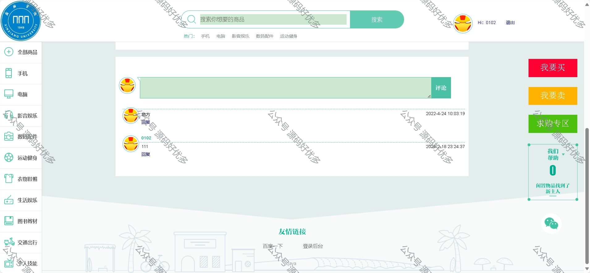

 
## 查看主页获取源码

> **作者介绍**： **✌**全网粉丝10W+本平台特邀作者、博客专家、CSDN新星计划导师、java领域优质创作者,博客之星、掘金/华为云/阿里云/InfoQ等平台优质作者、专注于毕业项目实战 **✌**

  

### 一、作品包含

源码+数据库+设计文档万字LW+PPT+全套环境和工具资源+部署教程

### 二、项目技术

前端技术：Html、Css、Js、Bootstrap

数据库：MySQL

后端技术：Java、Spring Boot、MyBatis

  

### 三、运行环境

开发工具：IDEA

数据库：MySQL8.0

数据库管理工具：Navicat10以上版本

环境配置软件： JDK1.8+Maven3.6.3

  

### 四、项目介绍
项目编号：springbootA027

前端主要包含登录注册、求购商品、发布商品、举报、评论五个核心管理模块。后端则主要包含系统设置、物品管理、学生管理、评论管理、举报管理、新闻公告六个核心管理模块。通过此模式不同属性的用户可在系统中进行对应操作

### 五、运行截图

  
